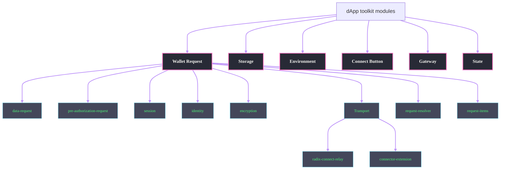

# Radix dApp Toolkit internal modules

### Wallet Request

The central module for handling all wallet-related interactions. It coordinates communication between the dApp and the Radix Wallet through various submodules:

- **data-request**: Manages data requests to and from the wallet
- **pre-authorization-request**: Handles wallet pre-authorization requests
- **session**: Manages wallet connection sessions
- **identity**: Handles user identity in context of wallet sessions
- **encryption**: Provides encryption services for secure communication
- **transport**: Manages different transport layers for wallet communication
- **request-resolver**: Matches outgoing requests to incoming responses
- **request-items**: Internal record of all requests

#### Transport Layer

The transport module supports multiple communication channels:

- **radix-connect-relay**: Handles communication through deep link and the Radix Connect relay service
- **connector-extension**: Manages browser extension-based connections

### Storage

Manages persistent data storage for the dApp, handling:

- Wallet connection states
- Session information
- Cache management

### Environment

Handles environment-specific configuration and detection:

- Platform-specific features
- Runtime configuration
- Environment-specific optimizations

### Connect Button

Provides the UI component for wallet connection:

- User interface for wallet connection
- Connection state management
- Visual feedback for connection states
- Customizable styling and behavior

### Gateway

Manages communication with the Radix Gateway:

- API endpoint management
- Transaction status polling

### State

Manages the global state of the dApp toolkit:

- Connection state
- Wallet state
- Request states
- Event management
