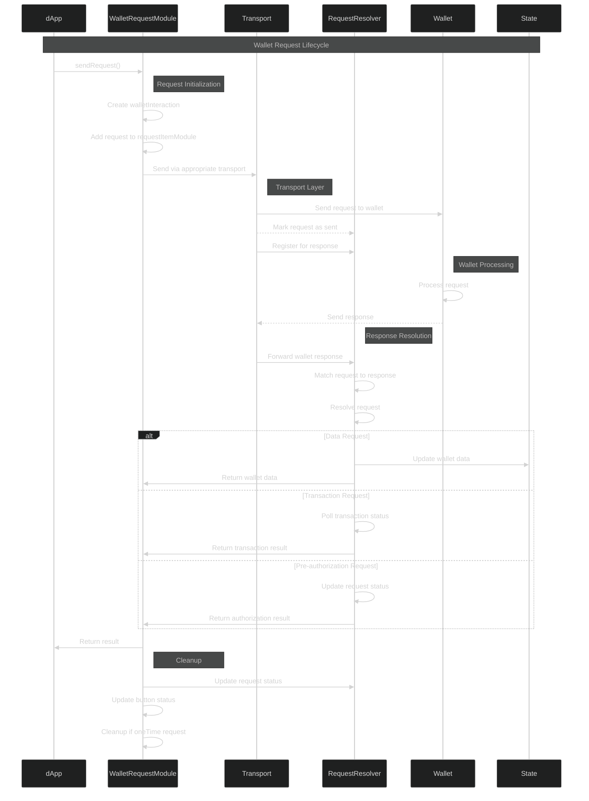

# Wallet request life-cycle

```mermaid
%%{init: { 'theme': 'dark' } }%%
sequenceDiagram
    participant App as dApp
    participant WR as WalletRequestModule
    participant TR as Transport
    participant RR as RequestResolver
    participant W as Wallet
    participant S as State

    Note over App,S: Wallet Request Lifecycle

    App->>WR: sendRequest()

    Note right of WR: Request Initialization
    WR->>WR: Create walletInteraction
    WR->>WR: Add request to requestItemModule
    WR->>TR: Send via appropriate transport

    Note right of TR: Transport Layer
    TR->>W: Send request to wallet
    TR-->>RR: Mark request as sent
    TR->>RR: Register for response

    Note right of W: Wallet Processing
    W->>W: Process request
    W-->>TR: Send response

    Note right of RR: Response Resolution
    TR->>RR: Forward wallet response
    RR->>RR: Match request to response
    RR->>RR: Resolve request

    alt Data Request
        RR->>S: Update wallet data
        RR->>WR: Return wallet data
    else Transaction Request
        RR->>RR: Poll transaction status
        RR->>WR: Return transaction result
    else Pre-authorization Request
        RR->>RR: Update request status
        RR->>WR: Return authorization result
    end

    WR->>App: Return result

    Note right of WR: Cleanup
    WR->>RR: Update request status
    WR->>WR: Update button status
    WR->>WR: Cleanup if oneTime request
```
