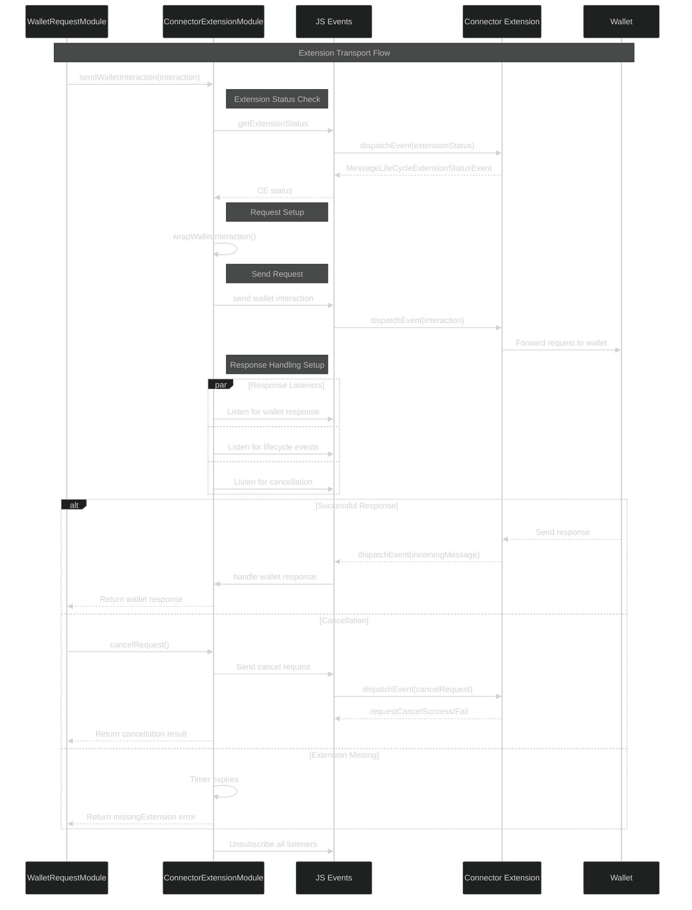

# Connector extension transport

```mermaid
%%{init: { 'theme': 'dark' } }%%
sequenceDiagram
    participant App as WalletRequestModule
    participant CE as ConnectorExtensionModule
    participant Sub as JS Events
    participant Ext as Connector Extension
    participant W as Wallet

    Note over App,W: Extension Transport Flow

    App->>CE: sendWalletInteraction(interaction)

    Note right of CE: Extension Status Check
    CE->>Sub: getExtensionStatus
    Sub->>Ext: dispatchEvent(extensionStatus)
    Ext-->>Sub: MessageLifeCycleExtensionStatusEvent
     Sub-->>CE: CE status

    Note right of CE: Request Setup
    CE->>CE: wrapWalletInteraction()

    Note right of CE: Send Request
    CE->>Sub: send wallet interaction
    Sub->>Ext: dispatchEvent(interaction)
    Ext->>W: Forward request to wallet

    Note right of CE: Response Handling Setup
    par Response Listeners
        CE->>Sub: Listen for wallet response
        and
        CE->>Sub: Listen for lifecycle events
        and
        CE->>Sub: Listen for cancellation
    end

    alt Successful Response
        W-->>Ext: Send response
        Ext-->>Sub: dispatchEvent(incomingMessage)
        Sub->>CE: handle wallet response
        CE-->>App: Return wallet response
    else Cancellation
        App->>CE: cancelRequest()
        CE->>Sub: Send cancel request
        Sub->>Ext: dispatchEvent(cancelRequest)
        Ext-->>Sub: requestCancelSuccess/Fail
        CE-->>App: Return cancellation result
    else Extension Missing
        CE->>CE: Timer expires
        CE-->>App: Return missingExtension error
    end

    CE->>Sub: Unsubscribe all listeners
```
