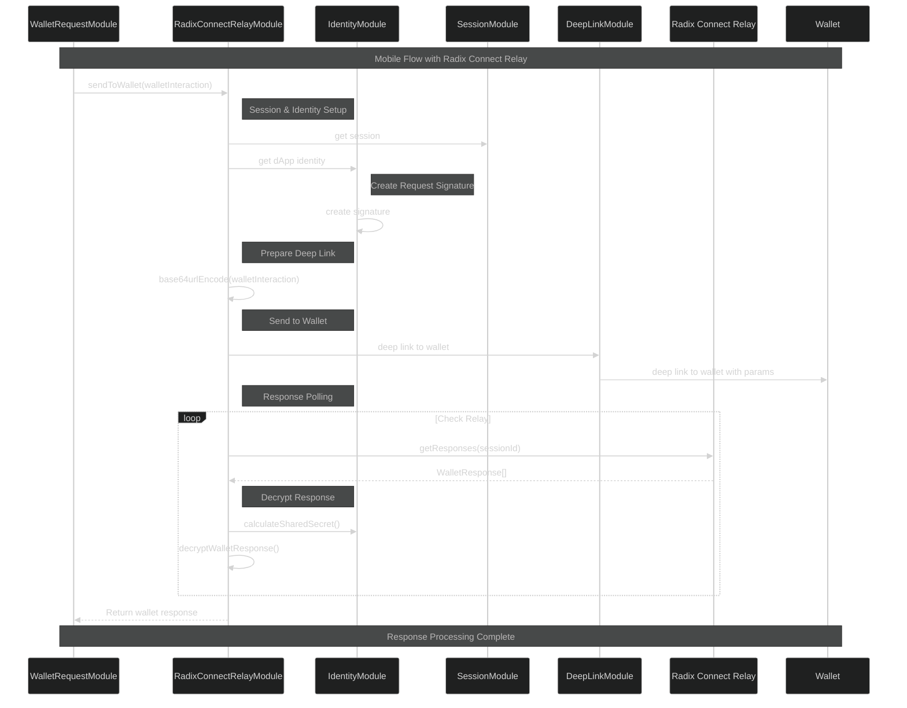

# Radix Connect Relay Transport

```mermaid
%%{init: { 'theme': 'dark' } }%%
sequenceDiagram
participant App as WalletRequestModule
participant RCR as RadixConnectRelayModule
participant IM as IdentityModule
participant SM as SessionModule
participant DL as DeepLinkModule
participant API as Radix Connect Relay
participant W as Wallet

    Note over App,W: Mobile Flow with Radix Connect Relay

    App->>RCR: sendToWallet(walletInteraction)

    Note right of RCR: Session & Identity Setup
    RCR->>SM: get session
    RCR->>IM: get dApp identity

    Note right of IM: Create Request Signature
    IM->>IM: create signature

    Note right of RCR: Prepare Deep Link
    RCR->>RCR: base64urlEncode(walletInteraction)

    Note right of RCR: Send to Wallet
    RCR->>DL: deep link to wallet

    DL->>W: deep link to wallet with params

    Note right of RCR: Response Polling
    loop Check Relay
        RCR->>API: getResponses(sessionId)
        API-->>RCR: WalletResponse[]

        Note right of RCR: Decrypt Response
        RCR->>IM: calculateSharedSecret()
        RCR->>RCR: decryptWalletResponse()
    end

    RCR-->>App: Return wallet response

    Note over App,W: Response Processing Complete
```
