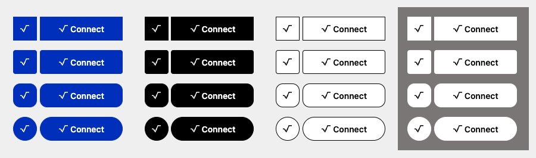
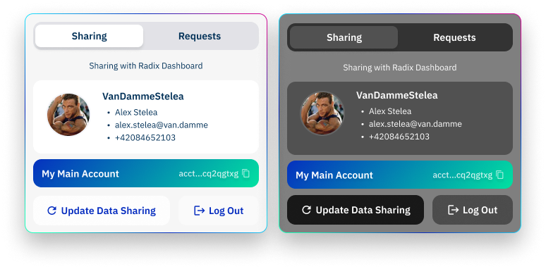

# What is Radix dApp Toolkit?

Radix dApp Toolkit (RDT) is a TypeScript library that automates getting users logged in to your dApp using a Persona, maintains a browser session for that login, and provides a local cache of data the user has given permission to your app to access associated with their Persona. It also provides an interface to request accounts and personal data from the user's wallet, either as a permission for ongoing access or as a one-time request, as well as to submit transaction manifest stubs for the user to review, sign, and submit in their wallet.

RDT supports both desktop and mobile browser web apps. For desktop browsers, it uses the Radix Wallet Connector browser extension. For mobile browsers, it employs deep linking, while maintaining the same essential interface for both.

**RDT is composed of:**

- **√ Connect Button** – A framework agnostic [custom element](https://html.spec.whatwg.org/multipage/custom-elements.html#custom-elements) that serves as user interface for RDT ([readme](../connect-button/README.md))

- **Tools** – Abstractions over lower level APIs for developers to build their radix dApps at lightning speed.

- **State management** – Handles wallet responses, caching and provides data to √ Connect button.

# Installation

## Using NPM

```bash
npm install @radixdlt/radix-dapp-toolkit
```

## Using CDN

Add following code to head section of your page. See example usage inside `examples/cdn/index.html`

```html
<script 
  src="https://cdn.jsdelivr.net/npm/@radixdlt/radix-dapp-toolkit@2.2.0/dist/radix-dapp-toolkit.bundle.umd.js" integrity="sha256-tSXTAPiW9BIch47ApYf4liLCrlZLw6actQH6OTDP6hI="
  crossorigin="anonymous"
></script>
```

## Using `create-radix-app`

Use our [CLI tool](https://github.com/radixdlt/create-radix-app) to scaffold a new project. Just paste following command into your terminal and it will walk you through all required steps.

```bash
npx create-radix-app@latest
```

# Usage

## Getting started

Add the `<radix-connect-button />` element in your HTML code and instantiate `RadixDappToolkit`.

```typescript
import {
  RadixDappToolkit,
  RadixNetwork,
  Logger,
} from '@radixdlt/radix-dapp-toolkit'

const rdt = RadixDappToolkit({
  dAppDefinitionAddress:
    'account_rdx12y7md4spfq5qy7e3mfjpa52937uvkxf0nmydsu5wydkkxw3qx6nghn',
  networkId: RadixNetwork.Mainnet,
  applicationName: 'Radix Web3 dApp',
  applicationVersion: '1.0.0',
  logger: Logger(1),
})
```

**Input**

- **requires** dAppDefinitionAddress - Specifies the dApp that is interacting with the wallet. Used in dApp verification process on the wallet side. [Read more](#setting-up-dapp-definition)
- **requires** networkId - Target radix network ID (for development use `RadixNetwork.Stokenet`).
- _optional_ applicationName - Your dApp name. It's only used for statistics purposes on gateway side
- _optional_ applicationVersion - Your dApp version. It's only used for statistics purposes on gateway side
- _optional_ logger - Configure and provide `Logger` instance if you want to deep dive into what's happening in RDT

There are more configuration options which are not described here. Please look up [`OptionalRadixDappToolkitOptions`](https://github.com/radixdlt/radix-dapp-toolkit/blob/c65fa2ad016b22e3b5a5410a0a1adc24bbee86fe/packages/dapp-toolkit/src/_types.ts#L48) to learn more.

## Login requests

The user's journey on your dApp always always starts with connecting their wallet and logging in with a Persona. The "Connect" button always requests a Persona login from the user's wallet.

The default behavior is to request the login alone, but you may also choose to add additional requests for account information or personal data to get at the time of login. This is useful if there is information that you know your dApp always needs to be able to function. You can also however choose to keep the login simple and make other requests later, as needed. Doing it this way allows your dApp to provide a helpful description in its UI of what a given piece of requested information is needed for, such as "please share all of your accounts that you want to use with this dApp" or "providing your email address will let us keep you informed of new features".

The Persona the user logs in with sets the context for all ongoing account and personal data requests for that session. The Radix Wallet keeps track of what permissions the user has provided for each dApp and each Persona they've used with that dApp. RDT automatically keeps track of the currently logged in Persona so that requests to the wallet are for the correct Persona.

After login, RDT also provides your dApp with a local cache of all account information and personal data that a user has given permission to share with your dApp for their chosen Persona.

For a pure frontend dApp (where you have no backend or user database), there is typically no reason for a Persona login to be verified and the login process is completely automated by RDT.

### User authentication

For a full-stack dApp there is also the user authentication flow. Typically, a full-stack dApp would request a persona together with a proof of ownership, which is then verified on the dApp backend using ROLA verification.

**What is a proof of ownership?**

A signature produced by the wallet used to verify that the wallet is in control of a persona or account.

```typescript
// Signed challenge
{
  type: 'persona' | 'account'
  challenge: string
  proof: {
    publicKey: string
    signature: string
    curve: 'curve25519' | 'secp256k1'
  }
  address: string
}
```

The signature is composed of:

| Item                                  |  Explanation                                                   |
| ------------------------------------- | -------------------------------------------------------------- |
| **prefix**                            | "R" (as in ROLA) in ascii encoding                             |
| **challenge**                         | 32 random bytes provided by the dApp                           |
| **length of dApp definition address** | String length of the dApp definition address                   |
| **dApp definition address**           | The dApp definition address of the requesting dApp             |
| **origin**                            | The origin of the dApp (e.g. `https://dashboard.radixdlt.com`) |

**Challenge**

In order to request a persona or account with proof of ownership a challenge is needed.

A challenge is a random 32 bytes hex encoded string that looks something like: `4ccb0555d6b4faad0d7f5ed40bf4e4f0665c8ba35929c638e232e09775d0fa0e`

If you're using JS for your backend you can use `generateRolaChallenge` function from Radix dApp Toolkit which will generate valid ROLA challenge for you. 

**Why do we need a challenge?**

The challenge plays an important role in the authentication flow, namely preventing replay attacks from bad actors. The challenge ensures that an authentication request payload sent from the client can only be used once. After a challenge is claimed by a request, the subsequent requests can no longer be resolved successfully with the same payload. As a security best practice, a stored challenge should have a short expiration time. In this case, just enough time for a user to interact with the wallet.

**Request persona with proof**

In order to request a proof, it is required to provide a function to RDT that produces a challenge.

```typescript
// const requestChallengeFromDappBackendFn = (): Promise<string> => 
//    http.get('/api/auth/challenge')

rdt.walletApi.provideChallengeGenerator(requestChallengeFromDappBackendFn)
rdt.walletApi.setRequestData(DataRequestBuilder.persona.withProof())
```

### Handle user authentication

A typical full stack dApp will require the user to provide proof of ownership. After sending a data request and getting the proof from the wallet, you need authenticate the user through ROLA on the dApp backend.

Use `walletApi.dataRequestControl` to provide a callback function that intercepts the RDT data request response flow. If no error has been thrown inside of the callback function the RDT flow will proceed as usual.

```typescript
rdt.walletApi.dataRequestControl(async (walletData) => {
  const personaProof = walletData.proofs.find(
    (proof) => proof.type === 'persona',
  )
  if (personaProof) await handleLogin(personaProof)
})
```

Throwing an error inside of `walletApi.dataRequestControl` callback will prevent RDT from getting into a logged in state. A full stack dApp may wish to do this to prevent RDT from treating the user as logged in because the ROLA authentication check failed, or for other application-specific reasons why a given user should not be allowed to login.

```typescript
rdt.walletApi.dataRequestControl(async (walletData) => {
  throw new Error('something bad happened...')
})
```

See [ROLA example](https://github.com/radixdlt/rola-examples) for an end-to-end implementation.

### Authenticate specific account or persona

Sometimes you want to restrict access to some parts of the system. For example you have admin part of your dApp which only people with specific identities can access. On the other hand, you don't want every user to go through ROLA process every time they login. Here's where ["one-time proof of ownership"](#one-time-data-request) request comes handy. Radix dApp Toolkit gives you you a way to ask Radix Wallet about **specific account addresses and identity**.

**Example:**

```typescript
  // const verifyProofInBackend = (proof: SignedChallenge): ResultAsync<T,E> => { ... }

  rdt.walletApi.sendOneTimeRequest(
    OneTimeDataRequestBuilder.proofOfOwnership().identity(
      'identity_tdx_2_12g3f29r62450l03ejucc2cf0pz52uawkwwm4um3chqxjjl2ffhq6f8',
    ),
  ).andThen((response) => {
    const proof = response.proofs.find((proof) => proof.address ==='identity_tdx_2_12g3f29r62450l03ejucc2cf0pz52uawkwwm4um3chqxjjl2ffhq6f8')
    return verifyProofInBackend(proof)
  })
```

> [!IMPORTANT]  
> If you want to use that, you need to configure challenge generator with `provideChallengeGenerator`


### User authentication management

After a successful ROLA verification it is up to the dApp's business logic to handle user authentication session in order to keep the user logged-in between requests. Although RDT is persisting state between page reloads, it is not aware of user authentication. The dApp logic needs to control the login state and sign out a user when needed.

**Expired user auth session**

If a user's auth session has expired it is recommended to logout the user in RDT as well. The dApp needs to call the `disconnect` method in order to but the user in a **not connected** state.

```typescript
rdt.disconnect()
```

The `disconnect` method resets the RDT state, to login anew, a wallet data request needs to be triggered.

## Wallet data requests

To provide a consistent user experience RDT stores data to the browser’s local storage. This will enable state rehydration and keep state between page reloads.

To understand which wallet responses that get stored we need to understand the difference between one-time and regular data requests.

One-time data requests do not register the dApp in the wallet and the connect button does not display that data in the UI. The data is meant to be used temporarily by the dApp and discarded thereafter.

A user connecting her wallet will be the first user flow in the majority of dApps. The connect flow is a bit different from subsequent data request flows. Its purpose is to provide the dApp with a minimal amount of user data in order for the user to be able to use the dApp, e.g. the minimal amount of data for a DEX dApp is an account.

RDT handles writing and reading data to the browser’s local storage so that it will be persisted between page loads. The dApp frontend logic can at any time ask RDT to provide the stored data by subscribing to the `walletApi.walletData$` observable or calling `walletApi.getWalletData`. One time data requests or requests that can not be resolved by the internal state are sent as data requests to the wallet.

For your dApp to access data from a user's wallet, whether account information or personal data, a request must be sent to the wallet. By default, the request will be "ongoing", meaning that the user will be asked for permission to share the information whenever they login to your dApp with their current Persona. A request may also be "one time" if it is for transient use and you do not require the permission to be retained by the user's wallet.

There are two ways to trigger a data request:

1. As part of the login request when the user clicks the √ Connect button's "Connect"
2. Programmatically through the walletApi.sendRequest method

#### Trigger wallet data request programmatically

```typescript
const result = await rdt.walletApi.sendRequest()

if (result.isErr()) return handleException()

// {
//   persona?: Persona,
//   accounts: Account[],
//   personaData: WalletDataPersonaData[],
//   proofs: SignedChallenge[],
// }
const walletData = result.value
```

### Change requested data

By default, a data request requires a Persona to set its context and so if the user is not already logged in, the data request will include a request for login.

Use `walletApi.setRequestData` together with `DataRequestBuilder` to change the wallet data request.

```typescript
rdt.walletApi.setRequestData(
  DataRequestBuilder.persona().withProof(),
  DataRequestBuilder.accounts().exactly(1),
  DataRequestBuilder.personaData().fullName().emailAddresses(),
)
```

### Data request builder

The `DataRequestBuilder` and `OneTimeDataRequestBuilder` is there to assist you in constructing a wallet data request.

#### `DataRequestBuilder.persona()`

```typescript
withProof: (value?: boolean) => PersonaRequestBuilder
```

Example: Request persona with proof of ownership

```typescript
rdt.walletApi.setRequestData(DataRequestBuilder.persona().withProof())
```

#### `DataRequestBuilder.accounts()`

```typescript
atLeast: (n: number) => AccountsRequestBuilder
exactly: (n: number) => AccountsRequestBuilder
withProof: (value?: boolean) => AccountsRequestBuilder
reset: (value?: boolean) => AccountsRequestBuilder
```

Example: Request at least 1 account with proof of ownership

```typescript
rdt.walletApi.setRequestData(
  DataRequestBuilder.accounts().atLeast(1).withProof(),
)
```

#### `OneTimeDataRequestBuilderItem.accounts()`

```typescript
atLeast: (n: number) => OneTimeAccountsRequestBuilder
exactly: (n: number) => OneTimeAccountsRequestBuilder
withProof: (value?: boolean) => OneTimeAccountsRequestBuilder
```

Example: Exactly 2 accounts

```typescript
rdt.walletApi.sendOneTimeRequest(
  OneTimeDataRequestBuilder.accounts().exactly(2),
)
```

#### `DataRequestBuilder.personaData()`

```typescript
fullName: (value?: boolean) => PersonaDataRequestBuilder
emailAddresses: (value?: boolean) => PersonaDataRequestBuilder
phoneNumbers: (value?: boolean) => PersonaDataRequestBuilder
reset: (value?: boolean) => PersonaDataRequestBuilder
```

Example: Request full name and email address

```typescript
rdt.walletApi.setRequestData(
  DataRequestBuilder.personaData().fullName().emailAddresses(),
)
```

#### `OneTimeDataRequestBuilderItem.personaData()`

```typescript
fullName: (value?: boolean) => PersonaDataRequestBuilder
emailAddresses: (value?: boolean) => PersonaDataRequestBuilder
phoneNumbers: (value?: boolean) => PersonaDataRequestBuilder
```

Example: Request phone number

```typescript
rdt.walletApi.sendOneTimeRequest(
  OneTimeDataRequestBuilder.personaData().phoneNumbers(),
)
```

#### `OneTimeDataRequestBuilderItem.proofOfOwnership()`

```typescript
accounts: (value: string[]) => ProofOfOwnershipRequestBuilder
identity: (value: string) => ProofOfOwnershipRequestBuilder
```

Example: Prove that user who is trying access admin page right is owner of given identity

```typescript
// const currentUserState = { .... }
rdt.walletApi.sendOneTimeRequest(
  OneTimeDataRequestBuilder.proofOfOwnership().identity(
    currentUserState.identity
  ),
)
```

#### `DataRequestBuilder.config(input: DataRequestState)`

Use this method if you prefer to provide a raw data request object.

Example: Request at least 1 account and full name.

```typescript
rdt.walletApi.setRequestData(
  DataRequestBuilder.config({
    personaData: { fullName: true },
    accounts: { numberOfAccounts: { quantifier: 'atLeast', quantity: 1 } },
  }),
)
```

### Handle connect responses

Add a callback function to `provideConnectResponseCallback` that emits a wallet response.

```typescript
rdt.walletApi.provideConnectResponseCallback((result) => {
  if (result.isErr()) {
    // handle connect error
  }
})
```

### One Time Data Request

Sometimes you want to get some data from the Radix Wallet based on various user actions like custom button click, page event, route change etc. One-time data requests are perfect way of doing that. One time data requests neither need any "auth" context nor they keep any state. The wallet response from a one time data request is meant to be discarded after usage. A typical use case would be to populate a web-form with user data, choose account, prove identity etc.

```typescript
const result = rdt.walletApi.sendOneTimeRequest(
  OneTimeDataRequestBuilder.accounts().exactly(1),
  OneTimeDataRequestBuilder.personaData().fullName(),
)

if (result.isErr()) return handleException()

// {
//   accounts: Account[],
//   personaData: WalletDataPersonaData[],
//   proofs: SignedChallenge[],
// }
const walletData = result.value
```

### Data Requests Sandbox

Play around with the different data requests in

- [Stokenet sandbox environment](https://stokenet-sandbox.radixdlt.com/)
- [Mainnet sandbox environment](https://sandbox.radixdlt.com/)

## State changes

Listen to wallet data changes by subscribing to `walletApi.walletData$`.

```typescript
const subscription = rdt.walletApi.walletData$.subscribe((walletData) => {
  // {
  //   persona?: Persona,
  //   accounts: Account[],
  //   personaData: WalletDataPersonaData[],
  //   proofs: SignedChallenge[],
  // }
  doSomethingWithAccounts(walletData.accounts)
})
```

When your dApp is done listening to state changes remember to unsubscribe in order to prevent memory leaks.

```typescript
subscription.unsubscribe()
```

Get the latest wallet data by calling `walletApi.getWalletData()`.

```typescript
// {
//   persona?: Persona,
//   accounts: Account[],
//   personaData: WalletDataPersonaData[],
//   proofs: SignedChallenge[],
// }
const walletData = rdt.walletApi.getWalletData()
```

## Transactions

Your dApp can send transactions to the user's Radix Wallet for them to review, sign, and submit them to the Radix Network.

Radix transactions are built using "transaction manifests", that use a simple syntax to describe desired behavior. See [documentation on transaction manifest commands here](https://docs.radixdlt.com/docs/transaction-manifest).

It is important to note that what your dApp sends to the Radix Wallet is actually a "transaction manifest stub". It is completed before submission by the Radix Wallet. For example, the Radix Wallet will automatically add a command to lock the necessary amount of network fees from one of the user's accounts. It may also add "assert" commands to the manifest according to user desires for expected returns.

> [!NOTE]
> Some of the manifests will have a nice presentation in the Radix Wallet, others will be displayed as raw text. Read more on ["comforming" transaction manifest stub format](https://docs.radixdlt.com/docs/conforming-transaction-manifest-types).


### Build transaction manifest

We recommend using template strings for constructing simpler transaction manifests. If your dApp is sending complex manifests a manifest builder can be found in [TypeScript Radix Engine Toolkit](https://github.com/radixdlt/typescript-radix-engine-toolkit#building-manifests)

### sendTransaction

This sends the transaction manifest stub to a user's Radix Wallet, where it will be completed, presented to the user for review, signed as required, and submitted to the Radix network to be processed. `sendTransaction` promise will only be resolved after transaction has been committed to the network (either successfuly or rejected/failure). If you want to do your own logic as soon as transaction id is available, please use `onTransactionId` callback. It will be called immediately after RDT receives response from the Radix Wallet.

```typescript
type SendTransactionInput = {
  transactionManifest: string
  version?: number
  blobs?: string[]
  message?: string
  onTransactionId?: (transactionId: string) => void
}
```

- **requires** transactionManifest - specify the transaction manifest
- **optional** version - specify the version of the transaction manifest
- **optional** blobs - used for deploying packages
- **optional** message - message to be included in the transaction
- **optional** onTransactionId - provide a callback that emits a transaction ID

<details>

<summary>sendTransaction example</summary>

```typescript
const result = await rdt.walletApi.sendTransaction({
  transactionManifest: '...',
})

if (result.isErr()) {
  // code to handle the exception
}

const transactionIntentHash = result.value.transactionIntentHash
```

</details>

## Preauthorization Requests

It is very similar to a transaction request, but it describes only a part of a final transaction – specifically the part that the user cares about, such as a swap they wish to perform within certain acceptable bounds. The pre-authorization is signed and returned to the dApp, which can then include it in a full transaction. A time bound is put on the pre-authorization, so the user knows for how long their pre-authorization is usable.

Creation of preauthorization request object is abstracted away into `SubintentRequestBuilder`. You can set exipration date in two modes:
- delay in **seconds after preauthorization is signed** by using `.setExpiration('afterDelay', 3600)`
- provided **exact unix timestamp** to function call `.setExpiration('atTime', 1234567890)`

**Example:**
```typescript
 const result = await dAppToolkit.walletApi.sendPreAuthorizationRequest(
    SubintentRequestBuilder()
      .manifest(subintentManifest)
      .setExpiration(
        'afterDelay',
        3600,
      )
      // .addBlobs('blob1', 'blob2')
      .message('This is a message')
      .onSubmittedSuccess((transactionIntentHash) => console.log('Submitted successfully', transactionIntentHash))
  )
```

# √ Connect Button

Radix dApp Toolkit provides a consistent and delightful user experience between radix dApps thanks to `<radix-connect-button />` [custom element](https://html.spec.whatwg.org/multipage/custom-elements.html#custom-elements). Although complex by itself, RDT is off-loading the developer burden of having to handle the logic of all its internal states.

Place following HTML element wherever you like in your HTML structure and you're all set. RDT will take care of finding element in DOM and make sure it's reactive to user clicks as well as provide data about current RDT state and wallet interactions.

```html
<radix-connect-button />
```

> [!IMPORTANT]
> **If you want to learn more about √ Connect Button, go to its [README](../connect-button/README.md)**

## Styling

Play around with the different configurations using the [√ Connect Button storybook](https://connect-button-storybook.radixdlt.com/)

### Themes

<div align="center">
 
</div>

There are four themes you can choose from by default: `radix-blue` (default), `black`, `white-with-outline`, `white` and a special one called `custom`. In order to do that, call following function after RDT instantiation

```typescript
rdt.buttonApi.setTheme('black')
```

Using `custom` theme will let you override additional CSS variables. With that you can completely change the UI for not connected connect button.

```css
body {
  --radix-connect-button-background: red;
  --radix-connect-button-text-color: black;
  --radix-connect-button-border-color: yellow;
  --radix-connect-button-background-hover: green;
}
```
### Modes

<div align="center">
 
</div>

You can choose between two modes: `dark` and `light` (default). In order to change mode you need execute following code.

```typescript
rdt.buttonApi.setMode('dark')
```

### CSS variables

There are three CSS variables available:

- `--radix-connect-button-width` (default 138px)
- `--radix-connect-button-height` (default 42px)
- `--radix-connect-button-border-radius` (default 0px)

```css
body {
  --radix-connect-button-width: 200px;
  --radix-connect-button-height: 42px;
  --radix-connect-button-border-radius: 12px;
}
```

> [!NOTE]
> Setting `--radix-connect-button-width` below `138px` will enable compact mode and cause persona label to hide

## Replacing the Connect Button

As RDT is built with dependency injection in mind you can replace Connect Button module with completely custom implementation of yours. In order to provide the same functionality you need to implement all the same methods. Please check [ConnectButtonModule implementation](src/modules/connect-button/connect-button.module.ts) for inspiration and [ConnectButtonNoopModule](src/modules/connect-button/connect-button-noop.module.ts) to clearly see the required interface. You start with providing your own module and then go wherever your imagination leads you

```typescript
const rdt = RadixDappToolkit({
  // usual RDT configuration...
  providers: {
    connectButtonModule: MyCustomConnectButtonModule({})
  }
})
```

# Further Reading

## ROLA (Radix Off-Ledger Authentication)

ROLA is a method of generating proof that certain user owns an identity or an account. It uses Radix Wallet to generate signature for dApp generated challenge and Radix Gateway to verify public keys of given identity or an account.

**Read more**

- [ROLA Monorepository](https://github.com/radixdlt/rola)
- [Typescript Full Stack Example](https://github.com/radixdlt/rola/tree/main/examples/typescript-full-stack)
- [Full-stack dApp](https://docs.radixdlt.com/docs/building-a-full-stack-dapp)

## Setting up dApp definition

Creating a dApp Definition account for your dApp will provide the necessary information for clients like the Radix Wallet to let users interact with your dApp in a way that is easy, safe, and informative. It also acts as a hub that connects all your dApp pieces together.

You can read more about dApp Definitions [here](https://docs.radixdlt.com/docs/metadata-for-verification).
You can read more about how to setup dApp definition [here](https://docs.radixdlt.com/docs/dapp-definition-setup)

## Building a dApp frontend

Go to Radix Documentation ["Building a Frontend dApp" article](https://docs.radixdlt.com/docs/building-a-frontend-dapp) to have a step-by-step walkthrough how to build your first decentralized application. You'll learn how to deploy your own smart contract on ledger and iteract with it using RDT

## Gateway SDK

When you want to start querying data about the ledger the easiest solution is using Gateway SDK. It provides a bunch of useful functions which you can use before you get in-depth understanding of ledger data as well as auto-generated (from open api spec) functions for every HTTP endpoint there is on Radix Gateway.

[@radixdlt/babylon-gateway-api-sdk](https://www.npmjs.com/package/@radixdlt/babylon-gateway-api-sdk?activeTab=readme)

# License

The Radix Dapp Toolkit binaries are licensed under the [Radix Software EULA](http://www.radixdlt.com/terms/genericEULA).

The Radix Dapp Toolkit code is released under [Apache 2.0 license](LICENSE).

      Copyright 2023 Radix Publishing Ltd

      Licensed under the Apache License, Version 2.0 (the "License"); you may not use this file except in compliance with the License.

      You may obtain a copy of the License at: http://www.apache.org/licenses/LICENSE-2.0

      Unless required by applicable law or agreed to in writing, software distributed under the License is distributed on an "AS IS" BASIS, WITHOUT WARRANTIES OR CONDITIONS OF ANY KIND, either express or implied.

      See the License for the specific language governing permissions and limitations under the License.
